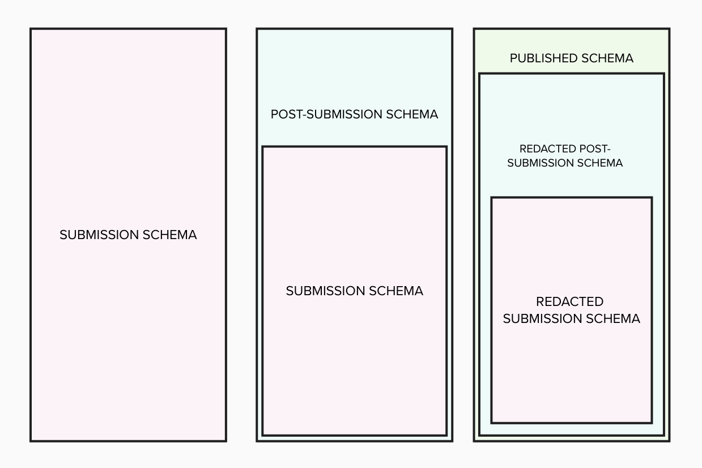

# Postsubmission Application Schema

## Overview

The `PostsubmissionApplication` schema extends the `PrototypeApplication` schema to represent a planning application _after it has been submitted_.

It captures and documents an application's progress through all stages of the planning process, including validation, consultation, assessment, and any appeals.

Once an application reaches the point where it enters consultation, or, for application types that don't have consultation, when it enters assessment, it becomes publicly viewable. At this point, when accessed publicly it is represented using the `PostsubmissionPublishedSchema`.

The `PostsubmissionPublishedSchema` is a redacted version of the `PostsubmissionApplication` schema. It includes only the information appropriate for public access, omitting personal or confidential data.



## Goals

The `PostsubmissionApplication` schema has been developed with three primary goals in mind.

### 🧠 Human Readability

The schema is structured using **clear, descriptive field names** and a predictable layout so that it can be easily understood by people without planning knowledge.

- Designed for people who want to inspect the data or follow the progress of an application programatically.
- Fields are grouped by logical stage (e.g. validation, consultation, assessment) to mirror the real-world planning process, making it easier to interpret and understand the data.
- Based on the applications' state and status you should be able to quickly determine the rest of the information you may need about an application, eg was it an appeal or a council decision that was made.

This ensures transparency in the planning process, increases accountability, and reduces the reliance on intermediaries to interpret data.

### ⚙️ Machine Usability

The schema is also designed to serve as a robust and flexible **API model** that can be consumed by digital services and software platforms across the planning ecosystem, should they choose to do so.

- Structured using conventional and predictable data types for easy validation, parsing, and rendering by applications.
- Suitable for use in backend systems, form builders, public planning portals, dashboards, or data pipelines.
- Easily converted into other machine-readable formats (eg, CSV, RDF, GeoJSON) to support interoperability.

**This makes it a strong foundation for building modern digital planning tools that require consistent, structured access to post-submission data.**

### 🔄 Flexible Usage

The schema is deliberately unopinionated about how it’s served or stored, making it adaptable to a wide range of implementations:

- Can be used as a static JSON file, e.g. to represent a historic application for archival or public inspection purposes.
- Can also be served dynamically via an API, allowing real-time updates as an application progresses through each post-submission stage.
- Works in both open data contexts (e.g. public registers) and internal planning systems (e.g. case management workflows, audit trails).
- This flexibility means it can be adopted incrementally, embedded in different technology stacks, or used to stitch together disconnected planning systems - without enforcing a specific technical architecture or vendor dependency.

## The Structure

At the highest level, the schema contains several top-level keys, each with a specific function:

- `applicationType` - identifies the kind of planning application being represented, using a standardised classification (e.g. pp.full.householder).
- `data` - contains structured, machine-readable information representing the status and progress of the application as processed by the planning authority.
- `comments` - holds public and specialist comments on the application, generally submitted by third parties or consultees.
- `files` - files from the original submission alongside additional files added in the back office system
- `submission` - contains the original submission in `PrototypeApplication` schema
- `metadata` - contains details about the document itself, not the application it describes (e.g. publishing body, schema version, UUID, timestamps, date data published).

```json
{
  "applicationType": "pp.full.householder",
  "data": {},
  "comments": {},
  "files": {},
  "submission": {},
  "metadata": {}
}
```

### Key Conventions

#### `data` — State of the application

The `data` section is where the authoritative state of the application lives. It is:

- Organised by **planning stages**, such as submission, validation, consultation, assessment, etc.
- Designed to represent the application **as it progresses**, with timestamps, boolean flags, and enumerated status values to enable logic-driven displays or decisions in applications.

This structure supports querying, sorting, filtering, and visualising application data at scale across different system types.

```json
{
  "application": {
    "reference": "ABC-123-XYZ",
    "stage": "assessment",
    "status": "determined",
    "publishedAt": "2024-02-19T15:54:31.021Z"
  },
  "localPlanningAuthority": {
    "publicCommentsAcceptedUntilDecision": false
  },
  "submission": {
    "submittedAt": "2024-02-18T15:54:30.821Z"
  },
  "validation": {
    "receivedAt": "2024-02-18T15:54:31.021Z",
    "validatedAt": "2024-02-19T15:54:31.021Z",
    "isValid": true
  },
  "consultation": {
    "startDate": "2024-02-19",
    "endDate": "2024-03-11",
    "siteNotice": true
  },
  "assessment": {
    "expiryDate": "2024-04-11",
    "planningOfficerRecommendation": "refused",
    "committeeSentDate": "2024-03-22",
    "committeeDecision": "granted",
    "committeeDecisionDate": "2024-04-01",
    "decisionNotice": {
      "url": "https://planningregister.org"
    }
  },
  "caseOfficer": {
    "name": "Casey Officer"
  }
}
```

##### `data.application`

This section contains the current, stage & status of an application. **Its important to note that the stage and status of an application is in does not strictly determine its state.** For example an application can be stage: consultation, state: undetermined but this does not automatically mean it is "In consultation" it is important to check the consultation start and end dates to be certain this is the case.

##### `data.localPlanningAuthority`

This section includes things about the application that are unique to that LPA's. See comments section below for more information on this.

##### `data.submission`

This contains `submittedAt` - this is the date which the application was submitted, either through PlanX or for example the date written on the envelope if it was posted.

##### `data.validation`

`receivedAt` is the date that the application is received by the back office system. It may not be the date it was sent, if there have been delays in the submission process.

`validatedAt` is the date `isValid` was set, **its presence doesn't mean that the application was valid**

This includes a flag for `isValid`, which can be used alongside status to find out when an application was set to `returned`.

##### `data.consultation?`

**An application is considered in consultation, if that stage exists, the minute it is validated. The minute it is validated it is also considered public.**

This includes the `startDate` and `endDate` of the consultation period.

Currently there is nothing in here about expiryDate or extensions to the consultation period.

During the consultation period an application can recieve comments.

Not all application types have consultation periods

##### `data.assessment?`

Assessment is when the council and optionally a committee make a decision. **The specification differentiates between `planningOfficerDecision` and `committeeDecision` on purpose in order to show our workings as to how the council decision was arrived at.**

`Council decision = planningOfficerDecision || committeeDecision`

**We don't show council decision as its own field as its too prone to errors and is a duplication of data.**

An application in assessment can have either `planningOfficerDecision` or `planningOfficerRecommendation + CommitteeDecision`

```json
{
  "planningOfficerDecision": "granted",
  "planningOfficerDecisionDate": "2024-03-21"
}
```

or

```json
{
  "planningOfficerRecommendation": "granted",
  "committeeSentDate": "2024-03-21",
  "committeeDecision": "granted",
  "committeeDecisionDate": "2024-04-01"
}
```

If an application is Prior Approval it also has `priorApprovalRequired` since they can be 'Prior approval required and approved', 'Prior approval not required', 'Prior approval required and refused'

Until there is a decision in this section an application is `undetermined`

##### `data.appeal?`

Appeal's are lodged, started, validated then decided.

While an appeal decision is being made an application is still set to `determined`.

An appeal can be started **before** an application goes to assessment, this is due to non-determination.

##### `data.caseOfficer`

This is the officer assigned to the application throughout the process.

#### `comments` — User submitted data

Comments can be submitted during the consultation period, which can bet determiend by looking in the `data.consultation.startDate` and `data.consultation.endDate` fields.

Not all applications have a consultation period, however some LPA's accept comments until a decision is made.

The `data.localPlanningAuthority.publicCommentsAcceptedUntilDecision` flag so that each LPA can set this and this flag will allow applications downstream to determine whether or not comments can be sent - without complicating the application process unduely

#### `metadata` — Schema Context

This section ensures clarity around:

- **Where** the document came from (organisation, id).
- **When** it was generated (generatedAt).
- **What schema version** it conforms to (schema).

```json
{
  "organisation": "BOPS",
  "id": "faae04cd-0ec2-479e-b7fb-14b3e7acae35",
  "submittedAt": "2024-02-18T15:54:30.821Z",
  "generatedAt": "2025-02-18T15:54:30.821Z",
  "schema": "https://theopensystemslab.github.io/digital-planning-data-schemas/@next/schemas/postSubmissionApplication.json"
}
```

## Implementation

Please see the [implementation documentation](https://github.com/theopensystemslab/digital-planning-data-schemas/blob/main/IMPLEMENTATION.md) for more information on how to implement the API to use alongside the schema

## The Planning Application Workflow

The application workflow goes through several stages until it's status becomes determined. The `PostsubmissionApplication` schema aims represents this workflow in as flexible a way as possible.

**Its important to note that the schema represents the _planning application_ workflow and not the backoffice workflows that manage and maintain it.**

### Status

Status represents whether or not an application is determined or not. So long as an application can still be determined from that point on its status will be `undetermined`. Where an application can never be made `determined` again the statuses `withdrawn` and `returned` are used.

- Determined
- Undetermined
- Returned
- Withdrawn

Each status reflects the high level state of which an application can be in.

- An application is **returned** if it is marked as invalid.
- An application can be **withdrawn** after submission and until a decision is made ie it is _determined_
- An application is **determined** if _any_ decision has been made about it, this could be assessment, appeal or high court appeal decisions
- An application is set to **undetermined** at all other times

We purposely avoid being too prescriptive in the status's. This is to simplify the creation and mapping of applications. It also allows room for growth and flexibility if the planning process changes in the future.

There are so many variations that this approach feels more straight forward. From each of these status' (and stages) you should be able to quickly determine the rest of the information you need about an application, eg was it an appeal or a council decision that was made.

### Stage

As an application goes through each stage contextual information is added to the corresponding section in the schema. Once a decision has been made the application is considered **determined**.

The order of the stages is mostly the same, however there are times where an appeal can come before an assessment for example.

- submission
- validation
- consultation (optional)
- assessment
- appeal (optional)
- highCourtAppeal (optional)

Submission, Validation and Assessment are all required stages. Whereas consultation, appeal and high court appeal are optional, dependant on other conditions.

## Combining the schema and application workflow

In the [examples](../../../examples/postSubmissionApplication/) section you will find examples for three application types in the various states an application can be in

- ldc (Lawful Development Certificate)
  - doesn't have a consultation period
  - Camden allow comments through localPlanningAuthority.publicCommentsAcceptedUntilDecision
- pa (Prior Approval)
  - has an additional field in assessment to generate an alternate decision
- pp (Planning Permission)

#### 01 Application submitted

When an application is submitted this how it would be represented in the `PostsubmissionApplication` schema

#### 02 Application validated

Technically this stage shouldn't exist as an application should pass straight to its consultation/assessment state (depending on application type)

#### 02.01 Application returned / Application invalid

If it fails validation the application is set to returned

#### 03 Consultation in progress

Applications goes into consultation (depending on application type)
Applications that are valid move immediately into consultation or assessment depending on whether the application type has a consultation period

#### 04 Assessment in progress

Application goes into assessment
Comments are no longer allowed unless the LPA allows it and a decision is made

#### 04 01 Council determined / Determined

Council decision is made
This is mostly where applications will be 'done'
This is what the application will look like when the council has made a decision and the applicaton is determined, comments will no longer be accepted.
Prior approval applications also have priorApprovalRequired flag which help determine the 'Prior approval required and approved', 'Prior approval not required', 'Prior approval required and refused' status

#### 04 02 Application in committee / Assessment in progress

Alternatively application goes to committee for determination
It goes with a recommendation for a decision from the council but this is different to the council decision.

#### 04 03 Committee determined / Determined

The committee then makes a decision

#### 05 Appeal lodged

An appeal is made

Things can end before this but within 6 months of the determination a decision can be appealed

#### 05 01 Appeal validated

After the appeal starts its validated

#### 05 02 Appeal started

Then it starts

#### 05 03 Appeal determined

appeal is determined

#### 06 Application withdrawn

An application can be with drawn only after validation and before a decision is made

## Appendix

### The Application Process


### Status


### Stages


### How we all fit in


